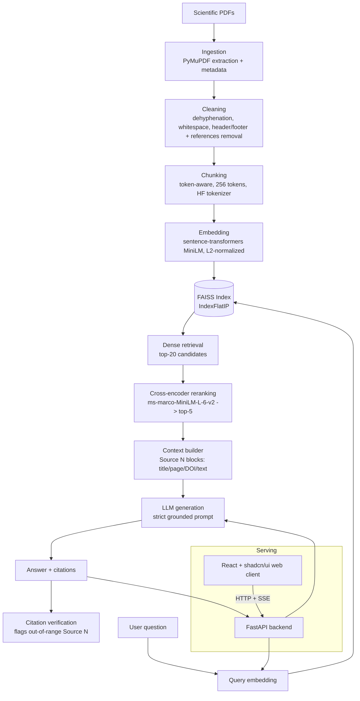

# CardioRAG

A Retrieval-Augmented Generation system for scientific literature on cardiovascular magnetic
resonance (CMR), cardiovascular imaging, and AI applied to cardiovascular medicine — built as an
end-to-end, incrementally developed and measured ML engineering project, not a framework demo.

**This is a research and educational tool, not a medical diagnostic system.** Its output must
never be treated as medical advice or a clinical recommendation.

## Problem

Scientific literature is a poor fit for how general-purpose LLMs answer questions. An LLM's
training data has a cutoff and cannot cite a specific page of a specific paper; asked a pointed
question about a niche finding, it will often produce a fluent, plausible-sounding answer with an
invented citation rather than admit it doesn't know. That failure mode is worse than unhelpful in
a scientific context — a fabricated DOI or a real DOI attached to a claim it never made is
actively misleading, and looks identical to a correct answer until someone checks.

Retrieval-augmented generation addresses this by making the LLM answer *from* a fixed, inspectable
set of documents rather than from memory: every claim can be traced back to a retrieved passage,
a page number, and (when available) a DOI. But that guarantee only holds if the retrieval,
chunking, and citation-tracking are built carefully — a RAG system that quietly loses page numbers
during chunking, or lets a reranker's confidence be mistaken for correctness, or can't tell a
genuine citation from a hallucinated one, provides false reassurance instead of real grounding.
This project treats each of those failure points as something to build, measure, and report on
honestly, not assume away.

## Architecture



The API and web client are separate processes/containers communicating over HTTP and Server-Sent
Events (Phases 15-16, 19; client rebuilt post-Phase 20 as a React SPA) — the client never touches
the embedding model, index, or LLM directly, and holds no logic beyond rendering what the API
returns.

## RAG Pipeline

```
PDF → extraction → cleaning → chunking → embeddings → FAISS index →
  [query] → query embedding → dense retrieval (top-20) → cross-encoder reranking (top-5) →
  context construction → LLM → grounded answer → citation verification
```

Each stage is a real, standalone module with its own tests — not a single call into a framework:

| Stage | Module | What it actually does |
|---|---|---|
| Ingestion | `ingestion/pdf_loader.py` | Per-page text extraction, content-addressed document IDs, extraction-issue detection (empty pages, duplicated headers/footers, hyphenation, references-section boundary) |
| Cleaning | `ingestion/cleaner.py` | Conservative normalization — never fabricates a fixed word from ambiguous input |
| Chunking | `chunking/chunker.py` | Token-aware sliding window using the *embedding model's own* tokenizer, not characters or a generic approximation |
| Embedding | `embeddings/embedder.py` | Batched, L2-normalized sentence-transformer encoding |
| Indexing | `retrieval/vector_store.py` | FAISS `IndexFlatIP` (see Technical Decisions) |
| Retrieval | `retrieval/retriever.py` | Query text → embedding → FAISS search, dimension-checked against the index |
| Reranking | `retrieval/reranker.py` | Cross-encoder scores `[query, passage]` jointly, unlike the bi-encoder |
| Generation | `generation/generator.py` + `prompts.py` | Refuses before calling the LLM if nothing was retrieved; strict evidence-only system prompt otherwise |
| Citations | `generation/citations.py` | Mechanically checks every `[Source N]` the LLM wrote against the sources it was actually given |

## Technical Decisions

Every decision below was made from a measurement, not intuition — the project's stated principle
from day one, and the reason Phases 11-14 exist at all.

**Embedding model — `sentence-transformers/all-MiniLM-L6-v2` (general-purpose), not a
science-specific model.** Compared against SPECTER (a model trained specifically on scientific
paper similarity via citation graphs) on the real 34-question evaluation set: MiniLM won on every
retrieval metric (Hit Rate 0.71 vs. 0.68, MRR 0.47 vs. 0.36). Plausible reason: SPECTER is trained
for document-level (title+abstract) similarity, not fine-grained passage retrieval for
question-answering — the actual task here. "Domain-specific" is not automatically "better" without
measuring it against the real task.

**Chunk size — 256 tokens**, chosen from a 256/512/768 sweep. 256 gave the best Hit Rate (0.82)
and MRR (0.60) of the three, at the cost of the worst Recall (0.19). Chosen deliberately: this
project's core value is citation trustworthiness (finding the *right* passage, ranked high) over
exhaustive evidence coverage — Hit Rate/MRR measure the former, Recall the latter.

**Similarity metric — inner product on L2-normalized vectors.** For unit vectors, inner product
*is* cosine similarity (`cos(a,b) = a·b / (|a||b|)`, and `|a|=|b|=1`), so FAISS's exact
`IndexFlatIP` computes cosine similarity directly, with no extra normalization step at query time.
Exact (not approximate/IVF) search is appropriate at this corpus's scale (a few hundred chunks) —
an ANN index only pays off at a scale this project is nowhere near.

**Reranking — cross-encoder, retrieve 20 → rerank to top-5.** Measured to substantially improve
retrieval quality on average (MRR 0.47 → 0.69, nDCG 0.26 → 0.43) — but a single hand-inspected
example earlier in the project suggested it "didn't help," which turned out to be misleading: one
example is not a measurement. The systematic 34-question evaluation is what settled it.

**LLM provider — abstracted, not hardcoded.** `generation/providers.py` defines an `LLMProvider`
protocol; `OpenAIProvider` implements it and, because Groq exposes an OpenAI-API-compatible
endpoint, also serves Groq with zero new provider code — just a different `base_url` and model
name. Real generation in this project runs on Groq's free tier for cost reasons.
`HuggingFaceLocalProvider` proves the same abstraction extends to a genuinely different kind of
backend — an in-process model, not an HTTP API at all — again with zero changes to
`generator.py` or the API routes. Not the default: see Limitations for the real citation-format
compliance gap measured against it.

**References-section exclusion at the chunking source, not post-filtering.** A standalone
"References"/"Bibliography" heading line — detected in *raw* text, before cleaning merges it into
the citation list — marks every following page as excluded from chunking entirely. Verified
against all 8 real corpus papers with zero false positives despite four different citation
styles. Removed 45% of the previously-chunked content (724 → 395 chunks) and measurably improved
every retrieval metric at the default config.

**Hybrid retrieval (dense + BM25 via Reciprocal Rank Fusion) — now the default, not plain dense.**
Dense embeddings dilute rare exact terms (an abbreviation, a specific method name); BM25 is a
classic term-frequency retrieval algorithm that catches them directly. Measured on the real
34-question set: hybrid beat dense-only on every metric (Hit Rate 0.82 → 0.94, MRR 0.60 → 0.72,
nDCG 0.30 → 0.40). One real, non-obvious finding along the way: Reciprocal Rank Fusion's
commonly-cited `k=60` (from the original paper, tuned for web-scale search over thousands of
candidates) measurably **buried** a real single-source top match at this corpus's scale — a
query for "MOCOnet" (a CNN named in exactly one paper) was correctly ranked #1 by BM25 alone,
but vanished from the fused top-5 under `k=60` once ~20 generically-related candidates each
ranked moderately in *both* lists collectively outscored it. `k=10` fixed it, verified against
that exact real query. Lesson applied consistently with the rest of this project: a "standard"
default is a starting point to measure at your own scale, not a value to trust unchecked.

**Query-embedding cache — process-local LRU, not a distributed cache.** `CachingEmbedder`
(`embeddings/caching_embedder.py`) wraps the API's embedder and caches by normalized query text,
only for single-text calls — the exact shape `Retriever.retrieve()` always uses, never the batch
shape chunk/ingestion embedding uses, so it adds nothing on that path. The real payoff is a
long-lived API process seeing a repeated question from different users/UI sessions; a one-off
script or test run starts with an empty cache and gets no benefit, which is expected. Verified
against the real embedding model: a repeated real query's second `embed()` call dropped from
0.011s to 0.0s and returned bit-identical vectors, with zero calls into the underlying model.

**Streaming responses — retry only before the first token, never mid-stream.** `LLMProvider` gained
a `stream()` method alongside `generate()`, implemented for real by all three concrete providers
(`OpenAIProvider` via the Chat Completions API's `stream=True`, `HuggingFaceLocalProvider` via
`transformers.TextIteratorStreamer` running generation on a background thread). `RetryingProvider.
stream()` deliberately only retries a rate limit hit *before* any piece has reached the caller —
once output has started flowing to an HTTP client, retrying would re-send already-streamed text
with no way for the client to undo it, so a failure past that point propagates instead (covered by
a dedicated test, `test_retrying_provider_stream_does_not_retry_once_a_piece_was_already_yielded`).
Verified against both real backends on the real corpus: the local provider (Fix #7) streamed a
real answer over 45.9s total instead of blocking silently for that long, while Groq streamed the
same kind of query in 1.4s — confirming streaming's UX value is concentrated almost entirely in
the slow local-inference path, not the already-fast hosted one. One real, minor artifact observed
with the local provider: `TextIteratorStreamer` occasionally emits empty-string `token` events
(partial byte-level BPE tokens with nothing decodable yet) — harmless, but a client rendering
tokens directly should skip empty ones rather than assume every `token` event carries visible text.

## Evaluation

All numbers below come from `data/evaluation/retrieval_eval_results.csv`,
`generation_eval_results.csv`, and `experiments.jsonl` — actually run against the real 8-paper
corpus and the 38-question hand-verified evaluation dataset (Phase 11). None are invented.

**Retrieval (Phase 12, n=34 answerable questions, varying one parameter at a time; re-run after
the front-matter boilerplate fix below — see Limitations for why these numbers shifted slightly
from an earlier version of this table):**

| Experiment | Variant | Hit Rate | MRR | Precision@K | Recall@K | nDCG@K |
|---|---|---:|---:|---:|---:|---:|
| Chunk size | 256 | 0.82 | 0.60 | 0.25 | 0.19 | 0.30 |
| Chunk size | 512 | 0.71 | 0.47 | 0.18 | 0.22 | 0.26 |
| Chunk size | 768 | 0.71 | 0.46 | 0.17 | 0.32 | 0.30 |
| Embedding model | MiniLM (general) | 0.71 | 0.47 | 0.18 | 0.22 | 0.26 |
| Embedding model | SPECTER (scientific) | 0.68 | 0.36 | 0.19 | 0.25 | 0.25 |
| top_k | k=3 | 0.53 | 0.43 | 0.22 | 0.16 | 0.25 |
| top_k | k=5 | 0.71 | 0.47 | 0.18 | 0.22 | 0.26 |
| top_k | k=10 | 0.85 | 0.49 | 0.16 | 0.38 | 0.32 |
| top_k | k=20 | 0.91 | 0.50 | 0.11 | 0.53 | 0.38 |
| Reranking | off | 0.71 | 0.47 | 0.18 | 0.22 | 0.26 |
| Reranking | on (retrieve 20 → rerank 5) | 0.85 | 0.69 | 0.29 | 0.37 | 0.43 |
| Retrieval mode | dense only | 0.82 | 0.60 | 0.25 | 0.19 | 0.30 |
| Retrieval mode | **hybrid (dense + BM25, RRF k=10)** | **0.94** | **0.72** | **0.33** | **0.27** | **0.40** |

(chunk_size/embedding_model/top_k/reranking rows other than the varied dimension use chunk_size=512,
MiniLM, top_k=5, no reranking as the fixed baseline; the retrieval-mode row uses chunk_size=256,
MiniLM, top_k=5, no reranking. See `scripts/evaluate_retrieval.py` and `data/evaluation/experiments.jsonl`
(EXP-015) for the hybrid comparison.)

**Generation (Phase 13, real LLM calls via Groq):**

| Metric | Value | n |
|---|---:|---:|
| Faithfulness (JSON-compliant judge subset) | 0.953 | 28 |
| Answer relevance | 0.777 | 28 |
| Context relevance | 0.582 | 28 |
| Hallucinated citations (out of range `[Source N]`) | 0 | 34 |
| Refusal correctness when evidence exists (should NOT refuse) | 100% | 34 |
| Refusal correctness on no-evidence questions (raw keyword heuristic) | 0%* | 4 |

\* **Manual inspection (also required by Phase 13, and where the real story was) found this
number is misleading on its own**: 2 of 4 answers substantively declined to answer but used
phrasing outside the original keyword list (since fixed); one fabricated a citation attributed to
a real, in-range source number. At the time, Phase 10's citation checker could not catch this
kind of fabrication — it only validated that a cited number existed, not that the attributed
content was real. That gap is now closed (see Technical Decisions / Limitations) by
`find_fabricated_quotes()`, verified against this exact real fabricated text.

The two generation-evaluation runs are logged as **separate** experiments in
`experiments.jsonl`, not blended: the last 10 of 38 questions were judged by a smaller fallback
model (`allam-2-7b`) after every higher-quality free-tier model's daily quota was exhausted, and
it didn't reliably follow the judge prompts' JSON format. Averaging a JSON-compliant judge with a
non-compliant one would have hidden that the two subsets aren't a comparable measurement.

## Installation

Requires Python 3.12+.

```bash
python -m venv .venv
.venv\Scripts\activate               # Windows; `source .venv/bin/activate` on Linux/macOS
pip install -e ".[ingestion,tokenization,ml,api,ui,llm,eval,dev]"
cp .env.example .env                 # then fill in OPENAI_API_KEY or GROQ_API_KEY
pytest                                # 268 tests
ruff check .                          # same lint gate CI runs
```

Dependency groups are split so you only install what a given phase needs — see the comments in
`pyproject.toml`. A free Groq API key (OpenAI-API-compatible, no cost) works with
`LLM_PROVIDER=groq` in `.env`; see `.env.example`.

**CI**: `.github/workflows/ci.yml` runs exactly those two commands (`ruff check .`, `pytest -q`) on
every push/PR to `master`, on a fresh `ubuntu-latest` runner with every extra installed — no LLM
API keys needed, since every provider-dependent test uses a fake/mock provider rather than a real
network call (see `tests/generation/test_providers.py`); the embedder/reranker fixtures do
download two small public models from the Hugging Face Hub, cached across runs via
`actions/cache`. **Verified against a real run, not just written and assumed to work**: the first
actual push to GitHub Actions failed — `test_expected_document_ids_match_the_real_corpus`
(`tests/evaluation/test_dataset.py`) loads the real PDFs in `data/corpus/` to cross-check the
hand-authored evaluation dataset, but those PDFs are gitignored (potentially copyrighted) and
therefore don't exist on a fresh CI checkout, so it failed with an empty corpus instead of a real
inconsistency. Fixed with an explicit `pytest.mark.skipif` (not by deleting or weakening the
check) — confirmed locally both ways: it runs and passes with the real corpus present, and skips
cleanly (rather than failing) with the corpus PDFs temporarily removed, simulating CI exactly.

Build the index once before running the API/UI/scripts against real data:
```bash
python scripts/embed_corpus.py   # embeds data/corpus/*.pdf into data/processed/
python scripts/build_index.py    # builds the FAISS index into indexes/
```

### Docker

```bash
docker compose build
docker compose run --rm api python scripts/embed_corpus.py   # if indexes/ is empty
docker compose run --rm api python scripts/build_index.py
docker compose up -d              # api on :8000, web on :8501
docker compose --profile redis up -d   # optional: also starts redis, for RATE_LIMIT_BACKEND=redis
```
Override host ports with `API_HOST_PORT`/`WEB_HOST_PORT` if those are already taken. See the
Docker section that follows for what was actually verified against a real build.

**Docker details, verified against a real build (not just written and assumed to work):**
`data/corpus`, `data/processed`, and `indexes/` are bind-mounted from the host rather than baked
into the image (they're gitignored, regenerated artifacts, and the corpus may be copyrighted).
Built both images and ran `API_HOST_PORT=8190 WEB_HOST_PORT=8591 docker compose up -d`, then
drove the running stack with a real headless browser (Playwright): `GET /health` reported
`num_chunks: 390` matching the host-mounted index; clicking a real example question in the web
client made a real `/query/stream` call to the containerized API, streamed a real Groq-generated
answer in 2.1s, and rendered 5 real sources with correct titles/DOIs — the full pipeline, through
the actual built containers, not a mock.

One real build-time gotcha this caught: Vite bakes `VITE_API_BASE_URL` into the static bundle at
**build** time, not container start. Running `docker compose build` once and then `docker compose
up` with a *different* `API_HOST_PORT` produces a web image whose bundle still points at the old
port — silently, with no error, just a browser that can never reach the API. `web/Dockerfile` and
the `web` service in `docker-compose.yml` both carry a comment about this now; changing
`API_HOST_PORT` requires rebuilding the `web` image (`docker compose build web`), not just
restarting the stack. (Container-to-container DNS, exercised by the old Streamlit UI's
server-side HTTP calls, is no longer relevant to this client: it's a static SPA the *browser*
loads, so it always talks to the API's host-facing port, never the Compose-internal `api`
hostname.)

## Usage

**Command line (single question, full pipeline):**
```bash
python scripts/ask.py "How does artificial intelligence improve cardiac MRI segmentation?"
```

**REST API:**
```bash
uvicorn cardiorag.api.main:app --port 8000
curl -X POST http://localhost:8000/query \
  -H "Content-Type: application/json" \
  -d '{"question": "How does AI improve cardiac MRI segmentation?", "top_k": 5}'
```

**Web client** (React + [shadcn/ui](https://ui.shadcn.com), see `web/README.md`):
```bash
cd web
npm install
cp .env.example .env.local   # VITE_API_BASE_URL, defaults to http://localhost:8000
npm run dev                  # requires the API running separately, see above
```

**Experiments** (chunking/embedding/retrieval/generation comparisons, all reproducible):
```bash
python scripts/compare_chunking_configs.py
python scripts/compare_embedding_models.py
python scripts/evaluate_retrieval.py
python scripts/evaluate_generation.py   # requires an LLM API key; makes real calls
```

## API

| Endpoint | Method | Auth / rate limit | Purpose |
|---|---|---|---|
| `/health` | GET | none (always open) | Index status, chunk count, whether an LLM provider is configured |
| `/retrieve` | POST | `X-API-Key` + rate limit | Hybrid (dense + BM25) retrieval only (no reranking, no generation) — for inspecting raw retrieval |
| `/query` | POST | `X-API-Key` + rate limit | Full pipeline: retrieve → rerank → generate |
| `/query/stream` | POST | `X-API-Key` + rate limit | Same pipeline as `/query`, emitted as Server-Sent Events instead of one blocking response |
| `/documents` | GET | `X-API-Key` + rate limit | List of indexed documents, grouped from chunk metadata |

Auth and rate limiting are both **opt-in**: with `API_KEY` unset (the default) they're disabled and
every endpoint behaves as before. Set `API_KEY` and, optionally, `RATE_LIMIT_PER_MINUTE` (default
60) in `.env` to require the header and cap requests per client IP — a missing/wrong key returns
401, exceeding the budget returns 429. See Limitations for what this does and doesn't protect
against.

`POST /query/stream` emits three SSE event types, in order: one `sources` event (right after
retrieval/reranking, before generation starts — the UI can show sources while the answer is still
being written), any number of `token` events (`{"text": "..."}`, one per generated piece), and a
final `done` event with the full assembled `answer`, `citation_warnings`, and `latency_ms` — or an
`error` event instead of `done` if generation fails mid-stream (the HTTP status is already 200 by
then; a request-level failure, like an empty question, still returns a normal 400/401/429 before
any SSE event is sent, same as `/query`).

No `/evaluate` endpoint: retrieval/generation evaluation is a long-running batch process over
dozens of LLM calls (see the generation evaluation saga in git history — five model swaps and two
real engineering fixes to get through a free-tier daily quota), not a request/response operation.

`POST /query` example response (real shape, `SourceInfo.pages` is a list — a deliberate deviation
from a single-int `"page"` example, since a chunk can span a page boundary since Phase 3):
```json
{
  "question": "How does AI improve cardiac MRI segmentation?",
  "answer": "Deep learning models automate left ventricle segmentation... [Source 1].",
  "sources": [
    {
      "title": "Improving the efficiency and accuracy of cardiovascular magnetic resonance...",
      "pages": [2, 3],
      "doi": "10.1016/j.jocmr.2024.101051",
      "chunk_id": "4ee13c3bf6c0ec17-0010",
      "document_id": "4ee13c3bf6c0ec17",
      "score": 0.685,
      "text": "..."
    }
  ],
  "latency_ms": 1972
}
```

## Limitations

Documented as found, not smoothed over — most were caught by this project's own tests or by
actually running the system against real data, not anticipated in advance.

**Ingestion / metadata**
- **Fixed, when a DOI was extracted**: `ingestion/crossref.py` queries the free CrossRef API for
  a paper's DOI and returns authoritative title/author/year data, as a separate, explicit
  enrichment step (never baked into `load_pdf()`, so core ingestion stays offline and
  deterministic — most of this project's ingestion tests depend on that). Run for real against
  all 8 corpus papers (`scripts/enrich_metadata.py`): 5 of 8 gained substantially more complete
  author lists (e.g. 1 author → 10, 0 → 3, 1 → 28), and one had its publication year corrected by
  5 years (2020 → 2025, PDF heuristic vs. CrossRef's actual record).
- **Still open**: CrossRef enrichment only helps when a DOI exists to look up. 2 of 8 papers
  (both arXiv preprints) have no DOI embedded in their PDF text at all — not an extraction bug,
  those papers genuinely don't have one — so their title-truncation/wrong-year issues remain
  exactly as before. One paper's "DOI" (`10.1162/tacl`) turned out to be a truncated journal-name
  fragment rather than a real DOI, confirmed by CrossRef returning 404 — a real extraction-quality
  signal this fix surfaced as a side effect, not something it fixes on its own.

**Cleaning / chunking**
- `unwrap_soft_line_breaks` treats a blank line as the only paragraph boundary; a list or table
  without blank lines between items gets merged into one line.
- ASCII-hyphen dehyphenation is deliberately conservative (keeps the hyphen to avoid corrupting
  compound terms like "T1-weighted") — a genuine line-wrap break leaves a residual hyphen
  ("informa-tion") rather than being perfectly joined.
- **Partially fixed, with an honest measured tradeoff**: `strip_boilerplate_sentences()` removes
  copyright/license sentences (e.g. "This is an open-access article distributed under the terms
  of the Creative Commons Attribution License... No use, distribution or reproduction is
  permitted...") using phrases taken from this project's own corpus, not guessed. Re-running
  Phase 12's full retrieval evaluation afterward showed all five metrics at the default config
  moved slightly *down* (Hit Rate 0.85→0.82, MRR 0.63→0.60) — plausible explanation: the
  (document, page) ground truth measures whether the right page was found, not whether the
  retrieved text is clean, so trimming a chunk's boilerplate can shift chunk composition without
  the metric rewarding it. Kept anyway (a deliberate call, not an oversight): a chunk that's
  mostly a copyright notice is still bad evidence even when it happens to match the expected
  page. Author-affiliation lists and editorial-workflow metadata (RECEIVED/REVIEWED/CITATION
  blocks) are a separate, harder problem this does NOT fix — a standalone "Abstract" heading was
  checked as a possible boundary marker (the same rigor applied to "References" in Phase 5-7) and
  found reliably present in only 5 of the 8 real corpus papers, too unreliable a signal to build
  on.
- **Retried with layout, still negative**: revisited the "Abstract" boundary using PyMuPDF's
  per-span font metadata instead of text matching, to see if the 3 papers missing a literal
  heading could be found by styling instead. Two real, different sub-findings, neither shippable.
  First, one of the 3 "misses" turned out to be a text-normalization bug, not a layout problem at
  all: that paper's heading *is* the literal word, just letter-spaced by the PDF's font
  (`'A B S T R A C T'`) — a cheap, unrelated fix (stripping internal whitespace before comparing)
  would recover it, independent of any layout signal. Second, for the other 2 papers — which have
  no "Abstract" label at all, just an unlabeled first paragraph — tested whether "the first text
  matching the document's dominant (font, size) style" reliably marks where that paragraph ends.
  It does, for those 2 papers specifically (one distinguished by font size, the other by font
  family — not the same signal, already a bad sign for generalizing). But run against all 8 real
  papers, it produced a false-positive match *inside the title/author-affiliation block* — far
  too early — on 3 of the other papers, and no match at all on a 5th (net: 4/8 correct, worse than
  the plain-text heading match's 5/8, and the failures are worse in kind, mis-tagging author names
  and affiliations as "abstract" rather than just missing a boundary). Not shipped: a heuristic
  that gets the *type* of error wrong that often isn't a net improvement, and 8 papers is too small
  a sample to safely add papers-9-through-∞-specific tuning on top without just overfitting further
  to this corpus. Real layout-aware extraction (this project's original guess at a fix) would mean
  reading the PDF's actual text-block geometry/reading order, not just the styling of the text
  content — meaningfully more work than either attempt here, and still unproven, so left as-is
  rather than half-built. See Future Work.
- **Fixed**: `ChunkingConfig.min_alpha_ratio` (default 0.4) drops chunks below that fraction of
  alphabetic characters. Calibrated against the real corpus, not guessed: inspecting the worst
  chunks by this metric showed genuine numeric-table junk (patient-demographics tables,
  confusion-matrix values, ROC-curve axis labels like "0 0.2 0.4 0.6 0.8 1.0" repeated) at ratios
  0.03-0.32, while the 5th percentile of all real chunks sits at 0.67 — comfortable separation, no
  arbitrary cutoff. Token count was checked first as a candidate signal and rejected: the
  *shortest* real chunks by token count were legitimate prose (a document's trailing paragraph),
  not degenerate content — length wasn't the right signal, alphabetic density was. Re-ran Phase
  12's evaluation after rebuilding the index (395 → 390 chunks, 5 dropped): metrics were
  essentially unchanged to marginally better (Recall@K ticked up slightly) — unlike fix #2, this
  one had no measured downside, consistent with the dropped chunks genuinely not being useful
  evidence for any of the 34 evaluation questions.

**Retrieval / generation**
- ~~The citation checker validates range but not content~~ **Fixed**: `find_fabricated_quotes()`
  in `generation/citations.py` now checks every verbatim quote attributed to a `[Source N]`
  against that source's actual text (exact substring, falling back to longest-common-substring
  ratio ≥ 0.6), and is wired into `/query`'s `citation_warnings` field and `scripts/ask.py`.
  Re-ran the exact real fabricated text found during Phase 13's manual inspection against it —
  correctly flagged (match ratio 0.008). Deliberately LLM-free (deterministic, consistent with
  the rest of this module) and deliberately narrow: it only catches verbatim
  quoted-and-attributed fabrications, not paraphrased ones — a paraphrased fabrication would need
  the LLM-based faithfulness check in `evaluation/generation_metrics.py` instead, which this does
  not replace.
- `looks_like_refusal` is a phrase-based heuristic anchored to observed real phrasing, not a
  semantic judgment — a model refusing in genuinely novel wording will be missed.
- **Fixed, with a real measured caveat**: `HuggingFaceLocalProvider` (Phase 20 fix #7) runs
  `Qwen/Qwen2.5-0.5B-Instruct` in-process via `transformers` — no API key, no per-request network
  call, works fully offline once the model is cached. A native Ollama client still raises
  `NotImplementedError`. Ran the real end-to-end pipeline against it for two real evaluation
  questions ("What is MOCOnet used for?", "How does artificial intelligence improve cardiac MRI
  segmentation?"): both produced fluent, topically relevant answers grounded in the retrieved
  text, but **neither included a single `[Source N]` citation**, despite the same system prompt
  that gets Groq/OpenAI models to cite reliably (see the `/query` example above). At 500M
  parameters this model doesn't reliably follow that instruction-format constraint — a real
  quality gap, not a bug, and the reason it's not the default `llm_provider`. `find_fabricated_quotes`
  can't catch this failure mode either: with no quotes and no attribution to check, there's
  nothing for it to flag. Also markedly slower on CPU (~40-60s/answer here vs. Groq's roughly
  1-2s) — expected for local inference with no GPU, not a bug either. Deliberately did NOT run
  the full quantitative Phase 13 suite (`scripts/evaluate_generation.py`) against it: that script
  reuses the configured provider as its own LLM-judge, and this project already established (see
  `groq_model`'s comment in `config.py`) that small models unreliably follow the
  "return-only-JSON" judge instructions — a 500M model self-judging its own faithfulness would
  produce numbers not trustworthy enough to report as a real measurement, which would defeat the
  purpose of measuring anything at all.
- **Fixed**: `retrieval/hybrid_retriever.py` combines dense retrieval with BM25 lexical search via
  Reciprocal Rank Fusion, beating dense-only on every metric on the real evaluation set (see
  Technical Decisions for the real `k=60` failure mode found and fixed along the way). Now the
  API/scripts default rather than an opt-in alternative.

**Scope / operations**
- The corpus is 8 papers (395 chunks post-cleaning) — intentionally small for this project's
  scope; any metric here carries real sampling variance and should not be read as a claim about
  performance on a production-scale corpus.
- **Fixed**: `/retrieve`, `/query` and `/documents` now require an `X-API-Key` header (401 if
  missing/wrong) and are rate-limited per client IP (429 past the configured budget) — both
  disabled by default (`API_KEY` unset) so local/dev use and every prior test keep working
  unchanged; an operator opts in via `.env`. `/health` is deliberately exempt from both, since the
  Docker Compose healthcheck polls it every 10s with plain curl and no credentials. The rate
  limiter is a small hand-rolled in-memory fixed-window counter (`api/rate_limit.py`), not a
  library — consistent with this project's "no framework black-boxing" approach — and, being
  per-process, is **not** correct across multiple API replicas (each would keep its own counters,
  multiplying the effective limit); a real limitation for anything beyond a single instance.
  Verified against a real running server: a wrong `X-API-Key` still consumes rate-limit budget
  (closing a brute-force-the-key gap that would exist if auth were checked before throttling).
- **Fixed**: `RATE_LIMIT_BACKEND=redis` swaps the per-process limiter for `RedisRateLimiter`
  (`api/redis_rate_limiter.py`), sharing one counter across every API replica pointed at the same
  `REDIS_URL` — same `INCR`-then-conditionally-`EXPIRE` recipe as the standard Redis rate-limiting
  pattern, correct without a Lua script because `INCR` is atomic and only ever returns `1` to
  exactly one caller per window. `memory` stays the default (nothing extra to run for local/single-
  instance use); the optional `redis` service in `docker-compose.yml` only starts with
  `docker compose --profile redis up`. Verified against a real Redis container two ways: (1) the
  window genuinely expires and resets after `window_seconds`; (2) two independent real `uvicorn`
  processes, alternating real HTTP requests to `/documents` with a shared limit of 3, correctly
  cut off at the 4th request *combined* regardless of which process served it — while the same
  alternating pattern against two independent in-memory `RateLimiter` instances let all 5 through,
  reproducing the exact "effective limit multiplies by replica count" problem this fixes.
- **Fixed**: `.github/workflows/ci.yml` runs `ruff check .` + `pytest -q` on every push/PR — see
  the CI note under Installation for what was actually verified (including a real first-run
  failure it caught and the fix for it).
- **Fixed**: the web client (`web/`, React + shadcn/ui, replacing the earlier Streamlit UI) was
  interactively tested end-to-end in a real headless browser via Playwright — a real health check,
  a real streamed query against the real Groq-backed API with sources rendering as they arrive,
  and the documents tab — not just built and assumed to work. Caught and fixed a real bug this
  way: the API had no CORS headers, so no browser-based client could read a response from a
  different origin at all until `CORSMiddleware` was added.

## Future Work

- Query expansion / decomposition for multi-part questions.
- Section-type metadata tagged at ingestion (body / references / boilerplate / abstract) so
  retrieval can filter by section, rather than relying solely on the references-heading heuristic.
  Two approaches tried and rejected so far (text-heading matching, then font-styling matching —
  see Limitations); real layout/reading-order-aware PDF parsing is the next thing to try, not yet
  attempted.
- The cheap, unrelated fix found during the layout retry above: normalize internal whitespace
  before comparing a candidate heading line (recovers a letter-spaced `"A B S T R A C T"` as a
  real "Abstract" match) — small, safe, never attempted because it surfaced mid-investigation of
  something else, not because it's risky.
- A larger corpus, to reduce sampling variance in the evaluation metrics.
- Domain-fine-tuned embeddings (contrastive fine-tuning on cardiovascular QA pairs), now that
  SPECTER's off-the-shelf underperformance is measured rather than assumed away.
- Figure/table extraction — currently text-only; a meaningful fraction of a CMR paper's evidence
  is in its figures.
- Cancel in-flight generation server-side when an SSE client disconnects mid-stream — right now
  the local provider's background generation thread runs to completion regardless, wasting CPU on
  an answer nobody will read.
- SSE reconnection/resume support — a dropped connection mid-stream currently means starting the
  whole question over, with no way to pick up from the last received token.
- Permanent Playwright e2e tests for the web client. It was tested end-to-end in a real browser
  (see Limitations) as one-off verification during development, not committed as a repeatable
  suite or wired into CI - `web/` has no test command of its own yet.

## License

[MIT](LICENSE)
