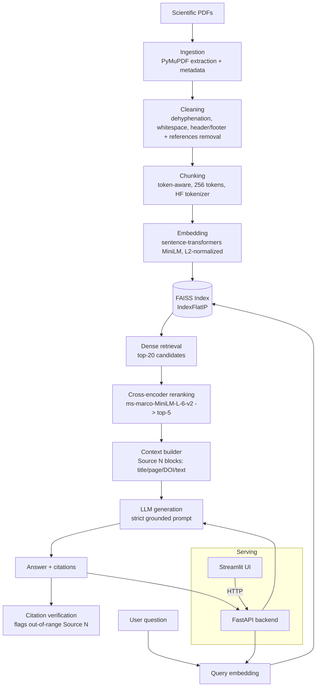

# CardioRAG

A Retrieval-Augmented Generation system for scientific literature on cardiovascular magnetic
resonance (CMR), cardiovascular imaging, and AI applied to cardiovascular medicine — built as an
end-to-end, incrementally developed and measured ML engineering project, not a framework demo.

**This is a research and educational tool, not a medical diagnostic system.** Its output must
never be treated as medical advice or a clinical recommendation.

## Problem

Scientific literature is a poor fit for how general-purpose LLMs answer questions. An LLM's
training data has a cutoff and cannot cite a specific page of a specific paper; asked a pointed
question about a niche finding, it will often produce a fluent, plausible-sounding answer with an
invented citation rather than admit it doesn't know. That failure mode is worse than unhelpful in
a scientific context — a fabricated DOI or a real DOI attached to a claim it never made is
actively misleading, and looks identical to a correct answer until someone checks.

Retrieval-augmented generation addresses this by making the LLM answer *from* a fixed, inspectable
set of documents rather than from memory: every claim can be traced back to a retrieved passage,
a page number, and (when available) a DOI. But that guarantee only holds if the retrieval,
chunking, and citation-tracking are built carefully — a RAG system that quietly loses page numbers
during chunking, or lets a reranker's confidence be mistaken for correctness, or can't tell a
genuine citation from a hallucinated one, provides false reassurance instead of real grounding.
This project treats each of those failure points as something to build, measure, and report on
honestly, not assume away.

## Architecture



The API and UI are separate processes/containers communicating over HTTP (Phases 15-16, 19) —
the UI never touches the embedding model, index, or LLM directly.

## RAG Pipeline

```
PDF → extraction → cleaning → chunking → embeddings → FAISS index →
  [query] → query embedding → dense retrieval (top-20) → cross-encoder reranking (top-5) →
  context construction → LLM → grounded answer → citation verification
```

Each stage is a real, standalone module with its own tests — not a single call into a framework:

| Stage | Module | What it actually does |
|---|---|---|
| Ingestion | `ingestion/pdf_loader.py` | Per-page text extraction, content-addressed document IDs, extraction-issue detection (empty pages, duplicated headers/footers, hyphenation, references-section boundary) |
| Cleaning | `ingestion/cleaner.py` | Conservative normalization — never fabricates a fixed word from ambiguous input |
| Chunking | `chunking/chunker.py` | Token-aware sliding window using the *embedding model's own* tokenizer, not characters or a generic approximation |
| Embedding | `embeddings/embedder.py` | Batched, L2-normalized sentence-transformer encoding |
| Indexing | `retrieval/vector_store.py` | FAISS `IndexFlatIP` (see Technical Decisions) |
| Retrieval | `retrieval/retriever.py` | Query text → embedding → FAISS search, dimension-checked against the index |
| Reranking | `retrieval/reranker.py` | Cross-encoder scores `[query, passage]` jointly, unlike the bi-encoder |
| Generation | `generation/generator.py` + `prompts.py` | Refuses before calling the LLM if nothing was retrieved; strict evidence-only system prompt otherwise |
| Citations | `generation/citations.py` | Mechanically checks every `[Source N]` the LLM wrote against the sources it was actually given |

## Technical Decisions

Every decision below was made from a measurement, not intuition — the project's stated principle
from day one, and the reason Phases 11-14 exist at all.

**Embedding model — `sentence-transformers/all-MiniLM-L6-v2` (general-purpose), not a
science-specific model.** Compared against SPECTER (a model trained specifically on scientific
paper similarity via citation graphs) on the real 34-question evaluation set: MiniLM won on every
retrieval metric (Hit Rate 0.76 vs. 0.65, MRR 0.49 vs. 0.38). Plausible reason: SPECTER is trained
for document-level (title+abstract) similarity, not fine-grained passage retrieval for
question-answering — the actual task here. "Domain-specific" is not automatically "better" without
measuring it against the real task.

**Chunk size — 256 tokens**, chosen from a 256/512/768 sweep. 256 gave the best Hit Rate (0.85)
and MRR (0.63) of the three, at the cost of the worst Recall (0.19). Chosen deliberately: this
project's core value is citation trustworthiness (finding the *right* passage, ranked high) over
exhaustive evidence coverage — Hit Rate/MRR measure the former, Recall the latter.

**Similarity metric — inner product on L2-normalized vectors.** For unit vectors, inner product
*is* cosine similarity (`cos(a,b) = a·b / (|a||b|)`, and `|a|=|b|=1`), so FAISS's exact
`IndexFlatIP` computes cosine similarity directly, with no extra normalization step at query time.
Exact (not approximate/IVF) search is appropriate at this corpus's scale (a few hundred chunks) —
an ANN index only pays off at a scale this project is nowhere near.

**Reranking — cross-encoder, retrieve 20 → rerank to top-5.** Measured to substantially improve
retrieval quality on average (MRR 0.49 → 0.74, nDCG 0.28 → 0.45) — but a single hand-inspected
example earlier in the project suggested it "didn't help," which turned out to be misleading: one
example is not a measurement. The systematic 34-question evaluation is what settled it.

**LLM provider — abstracted, not hardcoded.** `generation/providers.py` defines an `LLMProvider`
protocol; `OpenAIProvider` implements it and, because Groq exposes an OpenAI-API-compatible
endpoint, also serves Groq with zero new provider code — just a different `base_url` and model
name. Real generation in this project runs on Groq's free tier for cost reasons.

**References-section exclusion at the chunking source, not post-filtering.** A standalone
"References"/"Bibliography" heading line — detected in *raw* text, before cleaning merges it into
the citation list — marks every following page as excluded from chunking entirely. Verified
against all 8 real corpus papers with zero false positives despite four different citation
styles. Removed 45% of the previously-chunked content (724 → 395 chunks) and measurably improved
every retrieval metric at the default config.

## Evaluation

All numbers below come from `data/evaluation/retrieval_eval_results.csv`,
`generation_eval_results.csv`, and `experiments.jsonl` — actually run against the real 8-paper
corpus and the 38-question hand-verified evaluation dataset (Phase 11). None are invented.

**Retrieval (Phase 12, n=34 answerable questions, varying one parameter at a time):**

| Experiment | Variant | Hit Rate | MRR | Precision@K | Recall@K | nDCG@K |
|---|---|---:|---:|---:|---:|---:|
| Chunk size | 256 | 0.85 | 0.63 | 0.25 | 0.19 | 0.31 |
| Chunk size | 512 | 0.76 | 0.49 | 0.20 | 0.25 | 0.28 |
| Chunk size | 768 | 0.71 | 0.48 | 0.17 | 0.32 | 0.30 |
| Embedding model | MiniLM (general) | 0.76 | 0.49 | 0.20 | 0.25 | 0.28 |
| Embedding model | SPECTER (scientific) | 0.65 | 0.38 | 0.19 | 0.26 | 0.25 |
| top_k | k=3 | 0.59 | 0.45 | 0.23 | 0.17 | 0.26 |
| top_k | k=5 | 0.76 | 0.49 | 0.20 | 0.25 | 0.28 |
| top_k | k=10 | 0.85 | 0.50 | 0.14 | 0.35 | 0.31 |
| top_k | k=20 | 0.94 | 0.51 | 0.11 | 0.53 | 0.38 |
| Reranking | off | 0.76 | 0.49 | 0.20 | 0.25 | 0.28 |
| Reranking | on (retrieve 20 → rerank 5) | 0.88 | 0.74 | 0.31 | 0.38 | 0.45 |

(chunk_size/embedding_model/top_k/reranking rows other than the varied dimension use chunk_size=512,
MiniLM, top_k=5, no reranking as the fixed baseline; see `scripts/evaluate_retrieval.py`.)

**Generation (Phase 13, real LLM calls via Groq):**

| Metric | Value | n |
|---|---:|---:|
| Faithfulness (JSON-compliant judge subset) | 0.953 | 28 |
| Answer relevance | 0.777 | 28 |
| Context relevance | 0.582 | 28 |
| Hallucinated citations (out of range `[Source N]`) | 0 | 34 |
| Refusal correctness when evidence exists (should NOT refuse) | 100% | 34 |
| Refusal correctness on no-evidence questions (raw keyword heuristic) | 0%* | 4 |

\* **Manual inspection (also required by Phase 13, and where the real story was) found this
number is misleading on its own**: 2 of 4 answers substantively declined to answer but used
phrasing outside the original keyword list (since fixed); one fabricated a citation attributed to
a real, in-range source number — a problem Phase 10's citation checker cannot catch, since it
only validates that a cited number exists, not that the attributed content is real. See
Limitations.

The two generation-evaluation runs are logged as **separate** experiments in
`experiments.jsonl`, not blended: the last 10 of 38 questions were judged by a smaller fallback
model (`allam-2-7b`) after every higher-quality free-tier model's daily quota was exhausted, and
it didn't reliably follow the judge prompts' JSON format. Averaging a JSON-compliant judge with a
non-compliant one would have hidden that the two subsets aren't a comparable measurement.

## Installation

Requires Python 3.12+.

```bash
python -m venv .venv
.venv\Scripts\activate               # Windows; `source .venv/bin/activate` on Linux/macOS
pip install -e ".[ingestion,tokenization,ml,api,ui,llm,eval,dev]"
cp .env.example .env                 # then fill in OPENAI_API_KEY or GROQ_API_KEY
pytest                                # 194 tests
```

Dependency groups are split so you only install what a given phase needs — see the comments in
`pyproject.toml`. A free Groq API key (OpenAI-API-compatible, no cost) works with
`LLM_PROVIDER=groq` in `.env`; see `.env.example`.

Build the index once before running the API/UI/scripts against real data:
```bash
python scripts/embed_corpus.py   # embeds data/corpus/*.pdf into data/processed/
python scripts/build_index.py    # builds the FAISS index into indexes/
```

### Docker

```bash
docker compose build
docker compose run --rm api python scripts/embed_corpus.py   # if indexes/ is empty
docker compose run --rm api python scripts/build_index.py
docker compose up -d              # api on :8000, ui on :8501
```
Override host ports with `API_HOST_PORT`/`UI_HOST_PORT` if those are already taken. See the
Docker section that follows for what was actually verified against a real build.

**Docker details, verified against a real build (not just written and assumed to work):**
`data/corpus`, `data/processed`, and `indexes/` are bind-mounted from the host rather than baked
into the image (they're gitignored, regenerated artifacts, and the corpus may be copyrighted).
Built the image, ran `API_HOST_PORT=8090 UI_HOST_PORT=8591 docker compose up -d`, and confirmed:
`GET /health` reported `num_chunks: 395` matching the host-mounted index exactly; `POST /query`
made a real outbound call to Groq from inside the container and returned a grounded, sourced
answer; the UI served HTTP 200; and `docker exec ui curl http://api:8000/health` succeeded,
confirming container-to-container DNS actually works via Compose's network, not just that both
services happen to be independently reachable from the host.

## Usage

**Command line (single question, full pipeline):**
```bash
python scripts/ask.py "How does artificial intelligence improve cardiac MRI segmentation?"
```

**REST API:**
```bash
uvicorn cardiorag.api.main:app --port 8000
curl -X POST http://localhost:8000/query \
  -H "Content-Type: application/json" \
  -d '{"question": "How does AI improve cardiac MRI segmentation?", "top_k": 5}'
```

**Streamlit UI:**
```bash
streamlit run app/streamlit_app.py   # requires the API running separately, see above
```

**Experiments** (chunking/embedding/retrieval/generation comparisons, all reproducible):
```bash
python scripts/compare_chunking_configs.py
python scripts/compare_embedding_models.py
python scripts/evaluate_retrieval.py
python scripts/evaluate_generation.py   # requires an LLM API key; makes real calls
```

## API

| Endpoint | Method | Purpose |
|---|---|---|
| `/health` | GET | Index status, chunk count, whether an LLM provider is configured |
| `/retrieve` | POST | Dense retrieval only (no reranking, no generation) — for inspecting raw retrieval |
| `/query` | POST | Full pipeline: retrieve → rerank → generate |
| `/documents` | GET | List of indexed documents, grouped from chunk metadata |

No `/evaluate` endpoint: retrieval/generation evaluation is a long-running batch process over
dozens of LLM calls (see the generation evaluation saga in git history — five model swaps and two
real engineering fixes to get through a free-tier daily quota), not a request/response operation.

`POST /query` example response (real shape, `SourceInfo.pages` is a list — a deliberate deviation
from a single-int `"page"` example, since a chunk can span a page boundary since Phase 3):
```json
{
  "question": "How does AI improve cardiac MRI segmentation?",
  "answer": "Deep learning models automate left ventricle segmentation... [Source 1].",
  "sources": [
    {
      "title": "Improving the efficiency and accuracy of cardiovascular magnetic resonance...",
      "pages": [2, 3],
      "doi": "10.1016/j.jocmr.2024.101051",
      "chunk_id": "4ee13c3bf6c0ec17-0010",
      "document_id": "4ee13c3bf6c0ec17",
      "score": 0.685,
      "text": "..."
    }
  ],
  "latency_ms": 1972
}
```

## Limitations

Documented as found, not smoothed over — most were caught by this project's own tests or by
actually running the system against real data, not anticipated in advance.

**Ingestion / metadata**
- Title extraction takes the first substantial line of page 1; a multi-line title gets truncated
  (observed on a real paper in the corpus).
- Publication year extraction takes the first 4-digit number found; can match a citation year
  instead of the publication year.
- Author extraction relies on embedded PDF metadata only, which is often incomplete.
- *(Fix direction: query CrossRef/Semantic Scholar by the DOI, which extracts reliably, instead
  of trusting embedded PDF metadata.)*

**Cleaning / chunking**
- `unwrap_soft_line_breaks` treats a blank line as the only paragraph boundary; a list or table
  without blank lines between items gets merged into one line.
- ASCII-hyphen dehyphenation is deliberately conservative (keeps the hyphen to avoid corrupting
  compound terms like "T1-weighted") — a genuine line-wrap break leaves a residual hyphen
  ("informa-tion") rather than being perfectly joined.
- Front-matter boilerplate (author-affiliation lists, copyright/licensing notices) still gets
  chunked and occasionally retrieved — a different problem from the references-section issue that
  *was* fixed, not yet addressed.
- No minimum chunk-quality filter; a very short or degenerate chunk can still enter the index.

**Retrieval / generation**
- The citation checker (`generation/citations.py`) validates that a cited `[Source N]` number is
  in range — it cannot verify that the content attributed to that source is actually there. A
  real fabricated-citation case was found during Phase 13's manual inspection that this check did
  not catch.
- `looks_like_refusal` is a phrase-based heuristic anchored to observed real phrasing, not a
  semantic judgment — a model refusing in genuinely novel wording will be missed.
- Only `OpenAIProvider` (which also serves Groq) is implemented; `huggingface_local` and a native
  Ollama client raise `NotImplementedError` rather than fake support.
- No hybrid lexical+dense retrieval — a rare exact-term query (an abbreviation, a specific dataset
  name) relies entirely on the dense embedding capturing it.

**Scope / operations**
- The corpus is 8 papers (395 chunks post-cleaning) — intentionally small for this project's
  scope; any metric here carries real sampling variance and should not be read as a claim about
  performance on a production-scale corpus.
- No authentication or rate limiting on the API.
- No CI/CD pipeline configured.
- The Streamlit UI was verified to boot cleanly (server health checks, no tracebacks) but not
  interactively click-tested in a real browser — this environment has no browser automation tool.

## Future Work

- Hybrid BM25 + dense retrieval, for exact-term queries dense embeddings miss.
- Query expansion / decomposition for multi-part questions.
- Section-type metadata tagged at ingestion (body / references / boilerplate / abstract) so
  retrieval can filter by section, rather than relying solely on the references-heading heuristic.
- Content-level citation verification: compare a cited source's actual text against what the LLM
  attributed to it, closing the gap the current range-only checker leaves open.
- A larger corpus, to reduce sampling variance in the evaluation metrics.
- Domain-fine-tuned embeddings (contrastive fine-tuning on cardiovascular QA pairs), now that
  SPECTER's off-the-shelf underperformance is measured rather than assumed away.
- Figure/table extraction — currently text-only; a meaningful fraction of a CMR paper's evidence
  is in its figures.
- CI/CD, API authentication/rate limiting, for anything beyond local/single-user use.

## License

[MIT](LICENSE)
